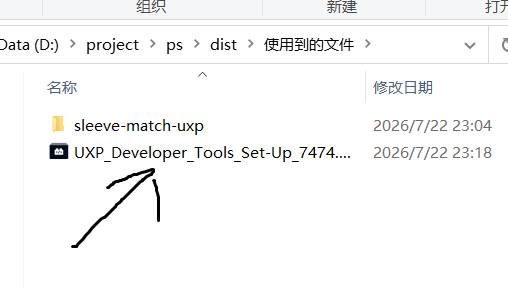
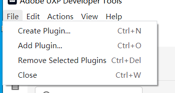
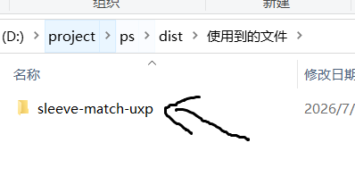
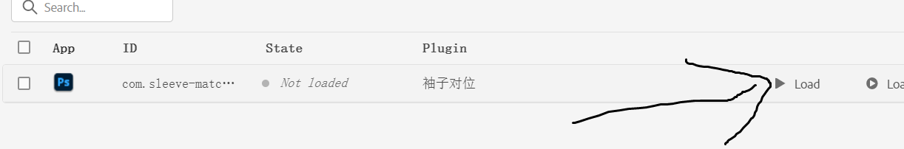
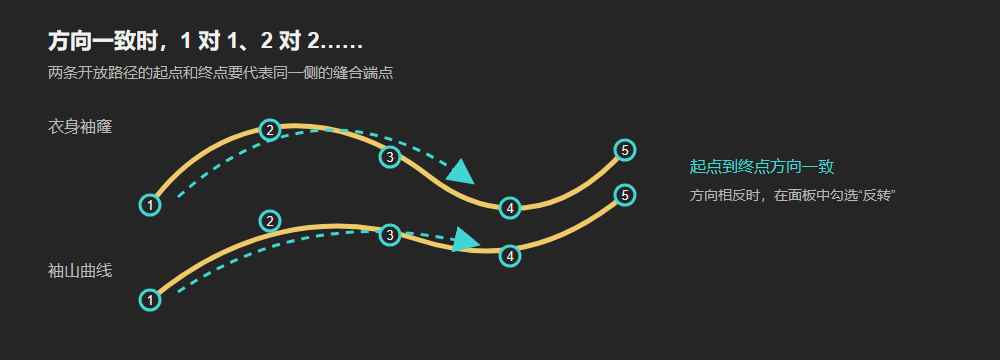

这份教程假设你平时只会使用 Photoshop 的图层、移动工具和缩放工具。你不需要会写代码，也不需要理解贝塞尔曲线的数学公式。跟着步骤做，就能完成第一次袖子对位。

## 先了解插件能做什么

插件会把两条路径上的位置按弧长配对，然后把这些配对位置画成十字标记。你选择一对标记后，插件会移动、旋转当前选中的袖子图层，让袖子上的对应位置对到衣身袖窿上。

插件不会自动完成以下事情：

- 不会自动识别衣片轮廓或自动寻找袖窿。
- 不会自动把一个完整图案做成网格变形或三维试衣效果。
- 不会替你制作图层蒙版、智能对象或印花裁片。
- 不会把标记路径打印到成衣图案中。标记只是 Photoshop 里的辅助路径。

最稳妥的工作方式是：先用插件完成快速定位，再用 Photoshop 的自由变换、智能对象或蒙版做最后检查。

## 你需要认识的 5 个词

| 词语 | 简单理解 |
| --- | --- |
| 图层 | 右侧“图层”面板里的每一行内容。印花、袖子轮廓和背景通常各是一层。 |
| 路径 | Photoshop 中用钢笔工具画出的矢量线，不会直接改变像素。 |
| 开放路径 | 只有起点和终点，没有首尾相连的线。插件要求使用这种路径。 |
| 袖窿 | 衣身上安装袖子的弧形边。 |
| 袖山 | 袖子顶部与衣身袖窿缝合的弧形边。 |

插件只读取“路径”面板里的路径，不会根据图层名称猜测袖窿或袖山。你需要自己沿着对应的缝线画两条路径。

## 一、安装插件

### 开发测试版

适合你自己试用，或者还在修改插件时使用。

1. 安装 Adobe UXP Developer Tool（双击安装）。（使用到的文件.zip 解压出来）



2. 打开 UXP Developer Tool，点击右上角 **File** 再点击 **Add Plugin**。



3. 选择插件(sleeve-match-uxp)目录里的 `manifest.json`。(插件在使用到的文件.zip里 解压出来)



4. 点击页面上出现的 **Load**。



5. 回到 Photoshop，打开 **插件 > 袖子对位**。部分 Photoshop 中文版本会在 **窗口 > 扩展 (UXP)** 中显示。
6. **需要安装 PS2022以上版本**

## 二、第一次使用前的准备

### 1. 先保存一个副本

第一次练习时建议使用 **文件 > 另存为**，保存一个副本，例如 `T恤_袖子对位练习.psd`。这样即使选错图层，也不会破坏原文件。

### 2. 确认袖子内容在一个图层或图层组里

在右侧“图层”面板中，找到你要定位的袖子印花或袖子图案：

- 如果袖子图案只有一层，之后直接选这一层。
- 如果袖子图案由多个图层组成，先选中它们并按 `Ctrl+G`（Mac 为 `Command+G`）放入一个图层组，之后选择这个图层组。
- 不要选择背景、衣身图层或整个 PSD 的最外层组，否则插件会移动错误的内容。
- 如果图层右侧有锁图标，先点击锁图标解锁。

### 3. 打开两个面板

建议同时打开：

- **窗口 > 图层**
- **窗口 > 路径**

路径面板的标签通常和“图层”“通道”在同一组中。你画好路径后，需要在这里给路径命名。

## 三、画第一条路径：衣身袖窿

### 1. 选择钢笔工具和路径模式

1. 按键盘 `P`，选择钢笔工具。
2. 看 Photoshop 顶部选项栏左侧，模式选择 **路径**。
3. 确认不是 **形状**，也不是 **像素**。

### 2. 放大画布

把画布放大到 200% 或 400%，沿着袖窿缝线画会更准确。你可以按住 `Ctrl+空格`（Mac 为 `Command+空格`）临时放大，然后拖动画布。

### 3. 只画对应的缝线段

从一个端点开始，沿着袖窿曲线画到另一个端点。不要画整个衣身轮廓，也不要把路径首尾闭合。

画曲线时：

- 直线位置单击即可。
- 弯曲位置按住鼠标左键拖动，拖出的手柄控制曲线方向。
- 一条袖窿曲线通常放 4 到 10 个锚点就够了。
- 锚点越多不一定越准确，重点是让路径贴合缝线。

结束开放路径时，可以按住 `Ctrl`（Mac 为 `Command`）在空白处单击，或者切换到其他工具。不要再单击第一个锚点，否则会闭合路径。

### 4. 保存路径名称

1. 在“路径”面板中找到 `工作路径` 或 `Work Path`。
2. 双击它的名称。
3. 改成容易辨认的名字，例如 `衣身-前袖窿`。

如果路径面板中没有工作路径，说明钢笔工具当前没有画在“路径”模式，请回到顶部选项栏检查。

## 四、画第二条路径：袖山

用同样的方法，沿袖子顶部与衣身缝合的那一段画第二条开放路径，例如命名为 `袖子-前袖山`。

### 两条路径应该怎么对应

两条路径最好使用相同的方向语义。例如，都是从腋下方向画到肩点方向：



如果你不确定方向，也可以先保存，之后在插件里的 **反转** 开关调整。路径方向不一致时，最常见的现象是第 1 个标记跑到了另一端。

### 一个重要的长度陷阱

衣身袖窿和袖山必须是同一段缝线的对应部分。不要拿“完整袖窿”去对“半个袖山”，也不要拿前袖窿去对后袖山，否则长度差会非常大。

如果一只袖子要分别对应前片和后片，建议分别画：

```text
衣身-前袖窿  ↔  袖子-前袖山
衣身-后袖窿  ↔  袖子-后袖山
```

插件当前是刚性定位工具，一次定位使用一对参考曲线。前后两侧需要分别检查，不能期望一次操作同时完成复杂的网格变形。

## 五、在面板中读取路径

1. 打开 **插件 > 袖子对位**。
2. 点击面板右上角的刷新按钮 `↻`。
3. 点击 **衣身袖窿** 下方的“选择路径”按钮，选择刚才保存的衣身路径。
4. 点击 **袖山曲线** 下方的“选择路径”按钮，选择袖子路径。

面板会显示袖窿弧长、袖山弧长和长度差。这个版本按“相同距离”转移点位，因此两条路径必须是相同长度的对应缝线；如果差异明显，插件会提示并禁用“生成匹配标记路径”。这时应检查是否选错了路径段，而不是打开缩放选项绕过问题。

### “反转”什么时候使用

打开 **反转** 开关后，插件会把该路径的起点和终点交换。使用规则很简单：

- 两条路径的第 1 个点应该是同一侧的端点。
- 两条路径的最后一个点应该是同一侧的端点。
- 如果标记顺序明显相反，只反转其中一条路径。

## 六、生成匹配标记

### 点数与定位点

默认是 5，插件会先把 5 个点平均分布在两条曲线上，方便开始操作。但平均分布只是初始值，你可以逐点改成图案真正需要的位置。

1. 点击 `1`、`2`、`3` 等按钮，选择要编辑的定位点。
2. 把需要作为定位依据的图案图层拖到第一条路径附近，并在“图层”面板中选中它。
3. 点击 **读取当前图层位置**。插件会以该图层的中心为准，找到第一条曲线上最近的位置，并自动记录“当前点距起点”的毫米数。
4. 如需微调，使用 **当前点距起点** 两侧的 `-`、`+`，每次调整 0.5 mm。
5. 依次处理其余点。第二条曲线会始终使用同一毫米距离，不能单独修改。

如果不需要按图案取点，可以直接用 **当前点距起点** 设置距离。点击 **重新平均分布定位点** 会放弃已手动设置的距离。

### 标记尺寸

默认 4 mm。它只影响 Photoshop 路径上十字标记的显示大小，不会改变衣服或印花尺寸。

### 生成

点击 **生成匹配标记路径**。插件会创建名为 `袖子对位-匹配标记` 的路径。回到“路径”面板并选中该路径后，你应该能看到两条曲线上出现十字标记。它们是辅助路径，不会出现在导出的 JPG、PNG 或印刷文件中。

## 七、定位袖子图层

### 1. 先选图层，再点击面板

回到“图层”面板，只选择一个袖子图层或袖子图层组。然后回到插件，确认 **当前袖子图层** 显示的名称正确。

如果显示“已选多个图层”，请回到图层面板，只保留一个选中项。

### 2. 选择定位基准点

面板中的按钮 `1`、`2`、`3` 等对应你刚刚设置的标记顺序：

- `1` 是路径起点。
- 最后一个按钮是路径终点。
- 中间按钮通常最适合第一次定位。

如果图案在某条横线、口袋线或明显的拼接线处需要连续，选择刚才根据该图案位置记录的那个标记。

### 3. 选择变换选项

- **按弧长缩放**：默认关闭。只有两条路径尺寸确实不同，且你确认需要改变图案尺寸时才打开。
- **翻转 180°**：袖子方向完全反了时使用。一般先尝试“反转”路径，仍然错误再使用这个选项。
- **角度补偿**：通常保持 `0°`。使用左右的 `-` 和 `+` 按钮，每次以 `0.5°` 微调。

### 4. 执行定位

点击 **定位当前袖子图层**。插件会读取所选标记的位置，计算袖子图层需要旋转和移动的数值，并把整个操作写入一个 Photoshop 历史步骤。

定位后请放大画布检查图案是否连续。如果结果不对，点击插件左上角的 `↶`，或者使用 `Ctrl+Z`（Mac 为 `Command+Z`）撤销，然后调整路径方向或基准点再试。

## 八、推荐的新手练习

第一次不要直接拿生产文件练习，可以这样做：

1. 新建一个空白 RGB 文档。
2. 用钢笔工具画一条弧形开放路径，命名为 `练习-衣身`。
3. 再画一条形状不同但方向相近的弧形路径，命名为 `练习-袖山`。
4. 新建一个矩形图层，写上“袖子测试”。
5. 在面板中读取两条路径，生成 5 个标记。
6. 选中矩形图层，分别尝试基准点 `1`、`3`、`5`。
7. 用撤销按钮熟悉回退流程。

练习的目的不是得到服装成品，而是理解“路径方向、标记编号、当前图层”三者的关系。

## 九、常见问题排查

### 路径选择按钮里没有路径

点击 `↻` 刷新。如果仍然没有，检查：

- Photoshop 中是否真的打开了文档。
- 钢笔工具顶部是否选择了“路径”模式。
- 路径是否已经在“路径”面板中双击保存并命名。
- 你画的路径是否至少有两个锚点。

### 提示“必须包含一条开放曲线”

你保存的是封闭轮廓。请重新沿缝线画一条开放路径，不要点击第一个锚点闭合路径。一个完整衣片轮廓不能直接代替袖窿缝线。

### 长度差特别大

最常见的原因是：

- 选中了整件衣片轮廓。
- 一条是完整袖窿，另一条只是半个袖山。
- 选错了前片或后片路径。
- 路径端点没有放在相同的缝合端点。

### 定位后袖子跑到了另一边

按以下顺序排查：

1. 撤销上一步。
2. 只反转衣身路径或只反转袖山路径中的一条。
3. 重新生成匹配标记。
4. 仍然方向相反时，撤销并打开“翻转 180°”。

### 定位后移动的是错误内容

插件只会移动当前选中的一个图层或图层组。回到图层面板，确认没有选中背景、衣身或整个文档组。如果图层名称显示正确但内容仍不对，建议把袖子相关图层放入单独图层组后再操作。

### 点击按钮后提示图层无法变换

检查图层是否锁定、是否为背景层、是否正在编辑文字、是否同时选中了多个图层。先解锁并只选一个图层组，再重试。

### 标记看不到

确认路径面板中选中的是 `袖子对位-匹配标记`。如果画布缩放很小，放大到 100% 或 200%。标记尺寸只影响路径显示，不影响实际图层。

## 十、完成前检查清单

- [ ] 已复制并保存原始 PSD。
- [ ] 衣身和袖子使用的是同一段对应缝线。
- [ ] 两条路径都是开放路径。
- [ ] 两条路径的起点和终点语义一致。
- [ ] 长度差没有异常大。
- [ ] 当前选中的是袖子图层或袖子图层组。
- [ ] 第一次定位时没有打开“按弧长缩放”。
- [ ] 定位后已放大检查图案连续性。
- [ ] 最终导出前已隐藏或取消选择辅助路径，并保存 PSD。

## 重要限制

当前版本的核心动作是平移、旋转和可选等比缩放，也就是刚性相似变换。它适合快速把袖子放到正确的缝线位置，但不能代替复杂的网格变形、透视变形或三维试衣软件。如果袖子本身需要沿多个方向拉伸，请先用插件完成基准定位，再使用 Photoshop 的 **编辑 > 变换 > 变形** 做最后调整。
