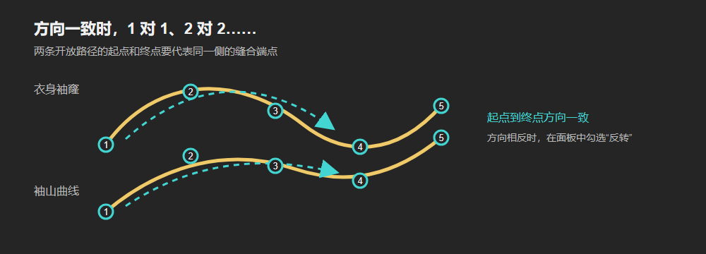

# 袖子对位：对花标记使用教程

这份教程假设你平时只会使用 Photoshop 的图层、移动工具和缩放工具。你不需要会写代码，也不需要理解贝塞尔曲线的数学公式。跟着步骤做，就能在衣身和袖子两条缝线路径上生成对应对花标记，作图时直接按标记移动图案，不用手动量距离。

## 先了解插件能做什么

插件会先记录第一条路径上每个对花点距起点的弧长距离，再换算这个位置占第一条路径总长的比例，并在第二条路径的相同比例处建立对应点。生成后，你会得到一条名为 `袖子对位-匹配标记` 的 Photoshop 路径，里面包含两条缝线上的成对十字标记。

一个简单例子：第一条路径长 50 mm，你把对花点设在距起点 20 mm 的地方，也就是 40%。第二条路径即使长 80 mm，插件也会把对应标记放在第二条路径的 32 mm 处，因为 80 × 40% = 32 mm。

插件不会自动完成以下事情：

- 不会自动识别衣片轮廓或自动寻找袖窿。
- 不会替你决定图案放在哪里；第一条路径上的对花点需要你自己设置。
- 不会自动把一个完整图案做成网格变形或三维试衣效果。
- 不会替你制作图层蒙版、智能对象或印花裁片。
- 不会把标记路径打印到成衣图案中。标记只是 Photoshop 里的辅助路径。

最稳妥的工作方式是：先用插件生成两条路径上的对应对花标记，再用 Photoshop 的移动、自由变换、智能对象或蒙版按标记对齐图案。面板里的图层定位功能只是可选辅助，不是必须步骤。

## 你需要认识的 5 个词

| 词语 | 简单理解 |
| --- | --- |
| 图层 | 右侧“图层”面板里的每一行内容。印花、袖子轮廓和背景通常各是一层。 |
| 路径 | Photoshop 中用钢笔工具画出的矢量线，不会直接改变像素。 |
| 开放路径 | 只有起点和终点，没有首尾相连的线。插件要求使用这种路径。 |
| 袖窿 | 衣身上安装袖子的弧形边。 |
| 袖山 | 袖子顶部与衣身袖窿缝合的弧形边。 |

插件只读取“路径”面板里的路径，不会根据图层名称猜测袖窿或袖山。你需要自己沿着对应的缝线画两条路径。

## 一、安装插件

### 开发测试版

适合你自己试用，或者还在修改插件时使用。

1. 安装 Adobe UXP Developer Tool。
2. 打开 UXP Developer Tool，点击 **Add Plugin**。
3. 选择插件目录里的 `manifest.json`。
4. 点击 **Load**。
5. 回到 Photoshop，打开 **插件 > 袖子对位**。部分 Photoshop 中文版本会在 **窗口 > 扩展 (UXP)** 中显示。

### 给别人使用的安装包

不要把开发 ZIP 直接当成普通安装包发给别人。使用 UXP Developer Tool 右侧菜单中的 **Package**，生成 `.ccx` 文件，再把 `.ccx` 发给对方。

对方只需要：

1. 安装 Creative Cloud Desktop。
2. 双击 `.ccx` 文件。
3. 在 Creative Cloud 的提示中确认安装。
4. 重启 Photoshop，打开 **插件 > 袖子对位**。

未提交 Adobe Marketplace 的插件会出现“未经 Adobe 验证”的提示。只有你确认文件来源可靠时，才应该点击“本地安装”。

## 二、第一次使用前的准备

### 1. 先保存一个副本

第一次练习时建议使用 **文件 > 另存为**，保存一个副本，例如 `T恤_袖子对位练习.psd`。这样即使选错图层，也不会破坏原文件。

### 2. 准备图案图层（可选）

生成对花标记本身只需要两条路径，不要求你选中图层。如果你想用 **读取选中图案中心** 来快速记录第一条路径上的对花位置，或想使用可选的图层定位功能，再提前整理图案图层：

- 如果图案只有一层，之后直接选这一层。
- 如果图案由多个图层组成，先选中它们并按 `Ctrl+G`（Mac 为 `Command+G`）放入一个图层组，之后选择这个图层组。
- 不要选择背景、衣身图层或整个 PSD 的最外层组，否则读取位置或可选定位时会使用错误内容。
- 如果图层右侧有锁图标，先点击锁图标解锁。

### 3. 打开两个面板

建议同时打开：

- **窗口 > 图层**
- **窗口 > 路径**

路径面板的标签通常和“图层”“通道”在同一组中。你画好路径后，需要在这里给路径命名。

## 三、画第一条路径：衣身袖窿

### 1. 选择钢笔工具和路径模式

1. 按键盘 `P`，选择钢笔工具。
2. 看 Photoshop 顶部选项栏左侧，模式选择 **路径**。
3. 确认不是 **形状**，也不是 **像素**。

### 2. 放大画布

把画布放大到 200% 或 400%，沿着袖窿缝线画会更准确。你可以按住 `Ctrl+空格`（Mac 为 `Command+空格`）临时放大，然后拖动画布。

### 3. 只画对应的缝线段

从一个端点开始，沿着袖窿曲线画到另一个端点。不要画整个衣身轮廓，也不要把路径首尾闭合。

画曲线时：

- 直线位置单击即可。
- 弯曲位置按住鼠标左键拖动，拖出的手柄控制曲线方向。
- 一条袖窿曲线通常放 4 到 10 个锚点就够了。
- 锚点越多不一定越准确，重点是让路径贴合缝线。

结束开放路径时，可以按住 `Ctrl`（Mac 为 `Command`）在空白处单击，或者切换到其他工具。不要再单击第一个锚点，否则会闭合路径。

### 4. 保存路径名称

1. 在“路径”面板中找到 `工作路径` 或 `Work Path`。
2. 双击它的名称。
3. 改成容易辨认的名字，例如 `衣身-前袖窿`。

如果路径面板中没有工作路径，说明钢笔工具当前没有画在“路径”模式，请回到顶部选项栏检查。

## 四、画第二条路径：袖山

用同样的方法，沿袖子顶部与衣身缝合的那一段画第二条开放路径，例如命名为 `袖子-前袖山`。

### 两条路径应该怎么对应

两条路径最好使用相同的方向语义。例如，都是从腋下方向画到肩点方向：



如果你不确定方向，也可以先保存，之后在插件里的 **反转** 开关调整。路径方向不一致时，最常见的现象是第 1 个标记跑到了另一端。

### 一个重要的长度陷阱

衣身袖窿和袖山必须是同一段缝线的对应部分。不要拿“完整袖窿”去对“半个袖山”，也不要拿前袖窿去对后袖山，否则长度差会非常大。

如果一只袖子要分别对应前片和后片，建议分别画：

```text
衣身-前袖窿  ↔  袖子-前袖山
衣身-后袖窿  ↔  袖子-后袖山
```

插件一次使用一对参考曲线生成对应标记。前后两侧需要分别画路径、分别生成标记，不能期望一次操作同时覆盖所有缝合边。

## 五、在面板中读取路径

1. 打开 **插件 > 袖子对位**。
2. 点击面板右上角的刷新按钮 `↻`。
3. 点击 **衣身袖窿** 下方的“选择路径”按钮，选择刚才保存的衣身路径。
4. 点击 **袖山曲线** 下方的“选择路径”按钮，选择袖子路径。

面板会显示袖窿弧长、袖山弧长和长度差。两条路径可以不等长，插件不会因此禁止生成标记，而是自动按总长度比例换算。例如第一条路径长 50 mm、对花点在 20 mm，第二条路径长 80 mm 时，对应点位于第二条路径的 32 mm 处。

### “反转”什么时候使用

打开 **反转** 开关后，插件会把该路径的起点和终点交换。使用规则很简单：

新版首次加载时，两条路径的 **反转** 都是关闭状态。请先按相同端点语义绘制两条路径；只有生成的第二条标记落到相反端时，才只打开其中一条的 **反转**。

- 两条路径的第 1 个点应该是同一侧的端点。
- 两条路径的最后一个点应该是同一侧的端点。
- 如果标记顺序明显相反，只反转其中一条路径。

## 六、生成对花标记

### 点数与对花点

默认是 1，适合“衣身图案在第一条路径已有一个拼接位置，要在袖子第二条路径找到对应位置”的情况。这个点默认放在第一条路径中间；你可以读取选中图案中心，或用 `-`、`+` 调整到图案实际经过缝线的位置。复杂图案需要多处校对时，再把点数增加到 2 到 9 个，插件会先将这些点平均分布，之后仍可逐点调整。

1. 点击 `1`、`2`、`3` 等按钮，选择要编辑的对花点。
2. 在 **第一条点距起点** 中设置这个点位于第一条路径上的距离。两侧的 `-`、`+` 每次调整 0.5 mm。
3. 如果图案已经放在第一条路径附近，也可以选中该图案图层，点击 **读取选中图案中心**。插件会以图层中心为准，找到第一条路径上最近的位置，并自动记录距离。
4. 依次处理其余对花点。第二条路径的距离由两条路径的总弧长比例自动换算，不能单独修改。
5. 查看 **第二条路径：按弧长比例 ... mm**，确认第二条路径上的对应距离是否符合预期。

如果不需要按图案取点，可以只用 **第一条点距起点** 设置距离。点击 **重新平均分布对花点** 会放弃已手动设置的距离。

### 标记尺寸

默认 4 mm。它只影响 Photoshop 路径上十字标记的显示大小，不会改变衣服或印花尺寸。

### 生成

点击 **生成两条路径对花标记**。插件会创建名为 `袖子对位-匹配标记` 的路径。回到“路径”面板并选中该路径后，你应该能看到两条缝线路径上出现成对十字标记。

这些十字标记就是给作图用的参考点：第一条路径上的标记表示你指定的图案位置；第二条路径上的标记表示按相同弧长比例换算出的袖子对应位置。它们是辅助路径，不会出现在导出的 JPG、PNG 或印刷文件中。

## 七、按标记作图

### 1. 手动按标记对花

生成 `袖子对位-匹配标记` 后，回到 Photoshop 画布和“路径”面板，选中这条标记路径。你会看到第一条路径和第二条路径上有编号顺序相同的成对十字标记。

作图时，把衣身图案和袖子图案移动到对应标记附近，让同一编号的标记成为拼接参考。例如第 3 个标记是衣身图案某条横线的位置，那么第二条路径上的第 3 个标记就是袖子上应该接这条横线的位置。

你可以使用 Photoshop 的移动工具、自由变换、智能对象或蒙版来完成最终对齐。插件生成的是参考点，不会替你判断图案需要怎样变形。

### 2. 标记编号怎么看

面板中的按钮 `1`、`2`、`3` 等对应你刚刚设置的对花点顺序：

- 点数为 1 时，只有一对标记，通常就是你最关心的拼接位置。
- 点数大于 1 时，标记按第一条路径从起点到终点排序。
- 两条路径方向一致时，第一条路径的第 3 点对应第二条路径的第 3 点。
- 如果编号明显反了，只反转其中一条路径，再重新生成标记。

### 3. 可选：按标记定位当前图层

如果你希望插件先帮你把一个图案图层移到对应位置，可以使用面板里的 **可选定位** 区域：

1. 回到“图层”面板，只选择一个需要移动的图案图层或图层组。
2. 回到插件，确认 **当前图案图层** 显示的名称正确。
3. 在 **第一条路径对花点** 中选择一个基准点。
4. 点击 **按标记定位当前图层**。

可选定位会以当前图层边界中心为变换中心，按选中的那一对标记计算平移和旋转。它适合把图案快速移到标记附近，但不等于最终制版。对花是否自然、图案是否需要局部变形，仍然需要你放大检查。

可选项说明：

- **按弧长缩放**：默认关闭。只有你确认需要按两条路径长度比例改变图案尺寸时才打开。
- **翻转 180°**：图案方向完全反了时使用。一般先尝试“反转”路径，仍然错误再使用这个选项。
- **角度补偿**：通常保持 `0°`。使用左右的 `-` 和 `+` 按钮，每次以 `0.5°` 微调。

结果不对时，点击插件左上角的 `↶`，或者使用 `Ctrl+Z`（Mac 为 `Command+Z`）撤销，然后调整路径方向、对花点或图层位置再试。

## 八、推荐的新手练习

第一次不要直接拿生产文件练习，可以这样做：

1. 新建一个空白 RGB 文档。
2. 用钢笔工具画一条弧形开放路径，命名为 `练习-衣身`。
3. 再画一条形状不同但方向相近的弧形路径，命名为 `练习-袖山`。
4. 在面板中读取两条路径，保持默认点数 1，生成一对标记。
5. 再把点数增加到 5，观察两条路径上的 5 对标记如何按比例对应。
6. 新建一个矩形图层，尝试用 **读取选中图案中心** 记录第一条路径上的一个点。
7. 重新生成标记，用 Photoshop 移动工具按标记对齐图案。

练习的目的不是得到服装成品，而是理解“第一条路径取点、第二条路径按比例出点、标记编号一一对应”这三件事。

## 九、常见问题排查

### 路径选择按钮里没有路径

点击 `↻` 刷新。如果仍然没有，检查：

- Photoshop 中是否真的打开了文档。
- 钢笔工具顶部是否选择了“路径”模式。
- 路径是否已经在“路径”面板中双击保存并命名。
- 你画的路径是否至少有两个锚点。

### 提示“必须包含一条开放曲线”

你保存的是封闭轮廓。请重新沿缝线画一条开放路径，不要点击第一个锚点闭合路径。一个完整衣片轮廓不能直接代替袖窿缝线。

### 长度差特别大

最常见的原因是：

- 选中了整件衣片轮廓。
- 一条是完整袖窿，另一条只是半个袖山。
- 选错了前片或后片路径。
- 路径端点没有放在相同的缝合端点。

### 生成后标记顺序反了

按以下顺序排查：

1. 撤销上一步。
2. 只反转衣身路径或只反转袖山路径中的一条。
3. 重新生成对花标记。
4. 确认两条路径的起点和终点语义一致。

### 可选定位后移动的是错误内容

可选定位只会移动当前选中的一个图层或图层组。回到图层面板，确认没有选中背景、衣身或整个文档组。如果图层名称显示正确但内容仍不对，建议把相关图案图层放入单独图层组后再操作。

### 点击按钮后提示图层无法变换

检查图层是否锁定、是否为背景层、是否正在编辑文字、是否同时选中了多个图层。先解锁并只选一个图层组，再重试。

### 标记看不到

确认路径面板中选中的是 `袖子对位-匹配标记`。如果画布缩放很小，放大到 100% 或 200%。标记尺寸只影响路径显示，不影响实际图层。

### 标记整体偏离缝线或缩向左上角

这通常是旧版本将非 72 ppi 文档中的路径坐标当成像素造成的。请在 UXP Developer Tool 中执行 **Unload > Load**，确认面板顶部显示 `v1.2.2`，然后删除旧的 `袖子对位-匹配标记` 路径并重新生成。旧标记不会自动移动到正确位置。

## 十、完成前检查清单

- [ ] 已复制并保存原始 PSD。
- [ ] 衣身和袖子使用的是同一段对应缝线。
- [ ] 两条路径都是开放路径。
- [ ] 两条路径的起点和终点语义一致。
- [ ] 长度差没有异常大。
- [ ] 第一条路径上的对花点已经按图案位置设置好。
- [ ] 第二条路径上的对应距离符合预期。
- [ ] 已放大检查标记附近的图案连续性。
- [ ] 最终导出前已隐藏或取消选择辅助路径，并保存 PSD。

## 重要限制

当前版本的核心动作是生成两条路径上的弧长比例标记。它适合解决“我知道第一条缝线上的图案位置，想快速找到第二条缝线对应位置”的问题，但不能代替复杂的网格变形、透视变形或三维试衣软件。如果图案本身需要沿多个方向拉伸，请先用插件生成参考标记，再使用 Photoshop 的 **编辑 > 变换 > 变形** 做最后调整。
